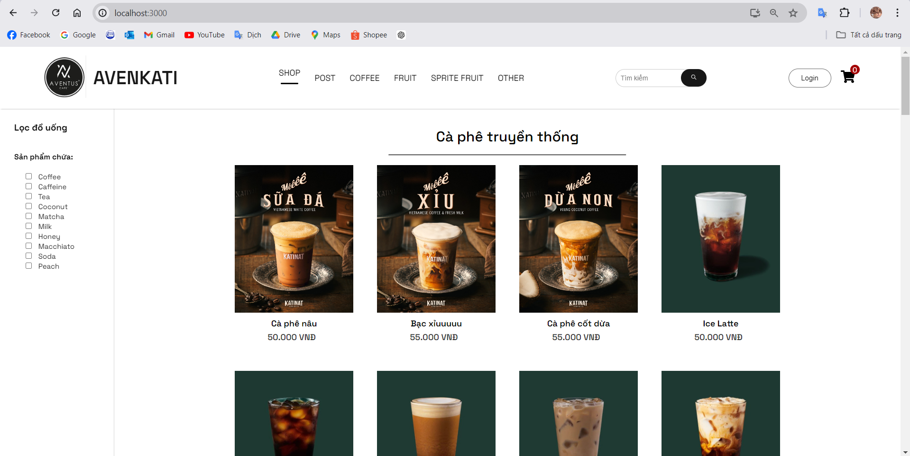

# The demo images and the introduction in Vietnamese below.
# Getting Started with Create React App

This project was bootstrapped with [Create React App](https://github.com/facebook/create-react-app).

## Available Scripts

In the project directory, you can run:

### `npm start`

Runs the app in the development mode.\
Open [http://localhost:3000](http://localhost:3000) to view it in your browser.

The page will reload when you make changes.\
You may also see any lint errors in the console.

### `npm test`

Launches the test runner in the interactive watch mode.\
See the section about [running tests](https://facebook.github.io/create-react-app/docs/running-tests) for more information.

### `npm run build`

Builds the app for production to the `build` folder.\
It correctly bundles React in production mode and optimizes the build for the best performance.

The build is minified and the filenames include the hashes.\
Your app is ready to be deployed!

See the section about [deployment](https://facebook.github.io/create-react-app/docs/deployment) for more information.

### `npm run eject`

**Note: this is a one-way operation. Once you `eject`, you can't go back!**

If you aren't satisfied with the build tool and configuration choices, you can `eject` at any time. This command will remove the single build dependency from your project.

Instead, it will copy all the configuration files and the transitive dependencies (webpack, Babel, ESLint, etc) right into your project so you have full control over them. All of the commands except `eject` will still work, but they will point to the copied scripts so you can tweak them. At this point you're on your own.

You don't have to ever use `eject`. The curated feature set is suitable for small and middle deployments, and you shouldn't feel obligated to use this feature. However we understand that this tool wouldn't be useful if you couldn't customize it when you are ready for it.

## Learn More

You can learn more in the [Create React App documentation](https://facebook.github.io/create-react-app/docs/getting-started).

To learn React, check out the [React documentation](https://reactjs.org/).

### Code Splitting

This section has moved here: [https://facebook.github.io/create-react-app/docs/code-splitting](https://facebook.github.io/create-react-app/docs/code-splitting)

### Analyzing the Bundle Size

This section has moved here: [https://facebook.github.io/create-react-app/docs/analyzing-the-bundle-size](https://facebook.github.io/create-react-app/docs/analyzing-the-bundle-size)

### Making a Progressive Web App

This section has moved here: [https://facebook.github.io/create-react-app/docs/making-a-progressive-web-app](https://facebook.github.io/create-react-app/docs/making-a-progressive-web-app)

### Advanced Configuration

This section has moved here: [https://facebook.github.io/create-react-app/docs/advanced-configuration](https://facebook.github.io/create-react-app/docs/advanced-configuration)

### Deployment

This section has moved here: [https://facebook.github.io/create-react-app/docs/deployment](https://facebook.github.io/create-react-app/docs/deployment)

### `npm run build` fails to minify

This section has moved here: [https://facebook.github.io/create-react-app/docs/troubleshooting#npm-run-build-fails-to-minify](https://facebook.github.io/create-react-app/docs/troubleshooting#npm-run-build-fails-to-minify)

# ẢNH DEMO ĐỒ ÁN TỐT NGHIỆP

## Giao diện trang chủ
Khách hàng truy cập vào website sẽ hiển thị danh sách đồ uống đang kinh doanh tại cửa hàng với hơn 50 sản phẩm đồ uống khác nhau được chia theo danh mục

## Giao diện đăng nhập
Để tiến hành mua hàng tại website khách hàng cần đăng nhập. Nếu khách hàng chưa có tài khoản có thể bấm đăng ký, nếu khách hàng nhập sai tài khoản hoặc mật khẩu hệ thống sẽ báo lỗi tài khoản hoặc mật khẩu không hợp lệ

## Giao diện đăng ký
Giao diện đăng ký cho khách hàng mới, chỉ cần điền các trường tên, email, mật khẩu các thông tin khác có thể bổ sung tại trang thông tin cá nhân khi khách hàng đăng nhập thành công vào website

## Giao diện trang chủ khi đã đăng nhập
Giao diện trang chủ khi đã đăng nhập so với chưa đăng nhập hiển thị biểu tượng trang cá nhân và cập nhật giỏ hàng của khách hàng ở góc trái trên cùng màn hình

## Giao diện xem thông tin sản phẩm
Sau khi lựa chọn được sản phẩm trang sẽ hiển thị thông tin mô tả sản phẩm và từ đây khách hàng sẽ thêm sản phẩm vào giỏ hàng, đánh giá sản phẩm. Chức năng này cần có tài khoản và đã đăng nhập thành công, nếu chưa sẽ đưa đến trang đăng nhập

Sau khi nhấn nút đánh giá, form đánh giá sẽ hiện lên, sau khi đánh giá xong và nhấn gửi đánh giá, trang sẽ cập nhật lại điểm và hiển thị đánh giá vào danh sách

## Giao diện tìm kiếm sản phẩm
Khách hàng muốn nhanh chóng tìm thấy đồ uống có thể nhập từ khóa vào ô tìm kiếm sau đó nhấn vào biểu tượng tìm kiếm, hệ thống sẽ hiển thị ra đồ uống thỏa mãn từ khóa tìm kiếm
 

Ngoài ra có thể thực hiện lọc đồ uống theo nguyên liệu có chứa thành phần gì

## Giao diện giỏ hàng
Sau khi lựa chọn được sản phẩm muốn mua và thêm vào giỏ hàng, khách hàng nhấn vào biểu tượng giỏ hàng, lựa chọn số lượng, kiểm tra hóa đơn và điền thông tin người nhận, nếu khách hàng điền thiếu thông tin nào đó, hệ thống sẽ báo cần điền thông tin tại trường bị thiếu

## Giao diện xem thông tin cá nhân và lịch sử mua hàng
Để quản lý thông tin cá nhân, xem lịch sử mua hàng, trạng thái đơn hàng, khách hàng nhấn vào biểu tượng trang cá nhân, ở trang này khách hàng có thể sửa thông tin cá nhân bằng cách nhấn vào nút chỉnh sửa
 

## Giao diện danh sách đơn hàng
Hiển thị danh sách các đơn hàng của cửa hàng, tại đây cũng sẽ cập nhật tình trạng đơn hàng của khách hàng. Các đơn hàng có trạng thái nào sẽ tương ứng màu sắc để dễ dàng theo dõi và đánh giá tình trạng kinh doanh của cửa hàng

## Giao diện danh sách các bài viết
Hiển thị danh sách các bài viết mà cửa hàng đang có, hiển thị thao tác chỉnh sửa ở cạnh mỗi bài viết tương ứng, chỉ hiển thị 1-2 bài viết giới thiệu về sản phẩm mà cửa hàng đang muốn kích cầu, tránh gây rối và loãng thông tin

## Giao diện thêm sản phẩm mới
Giao diện trang thếm sản phẩm mới bao gồm chi tiết các thông tin về đồ uống, hình ảnh đồ uống, trạng thái đồ uống (on, off), trạng thái này quyết định sản phẩm có được hiển thị trên website hay không

## Giao diện danh sách sản phẩm và chỉnh sửa sản phẩm đã có
Giao diện danh sách sản phẩm, hiển thị thanh tìm kiếm để tìm đến sản phẩm nhanh nhất, hiển thị thao tác có thể thực hiện đối với sản phẩm: sửa thông tin, xóa sản phẩm. Khi nhấn vào biểu tượng sửa tại sản phẩm muốn sửa hệ thống sẽ chuyển đến trang sửa thông tin và cập nhật các thông tin của sản phẩm vào các trường textbox

Sửa thông tin sản phẩm:

## Giao diện trang thống kê doanh thu
Hiển thị doanh thu của cửa hàng và biểu đồ so sánh doanh thu theo tháng

